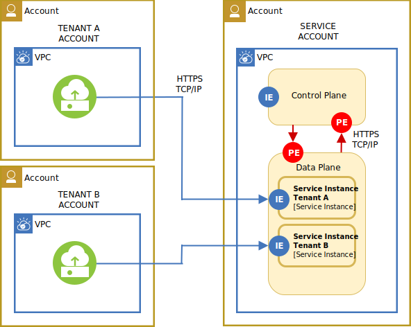

---

copyright:
  years: 2020, 2023
lastupdated: "2023-12-14"

keywords: SQL query, security, enhancing security, deployment model

subcollection: sql-query

---

{:new_window: target="_blank"}
{:shortdesc: .shortdesc}
{:screen: .screen}
{:codeblock: .codeblock}
{:pre: .pre}

# Deployment model
{: #deployment}

{{site.data.keyword.sqlquery_full}} is deprecated. As of 18 February 2024 you can't create new instances, and access to free instances will be removed. Existing Standard plan instances are supported until 18 January 2025. Any instances that still exist on that date will be deleted.
{: deprecated}

{{site.data.keyword.sqlquery_short}}'s Deployment Model corresponds to a public service with public endpoints. It is the publicly shared multi-tenant deployment model for IBM Services, and as such, this model is not dedicated. The service is accessed through public endpoints. Both, the control and data plane of the service, are shared across tenants.

Tenant isolation models | Tenant domain isolation | Endpoint isolation | Compute isolation | Storage isolation | Network isolation
--- | --- | --- | --- | --- | ---
Shared data plane | Service account | Public endpoint | Shared physical hosts | Shared physical storage devices, shared access endpoint | Service virtual network

{: caption="Deployment model" caption-side="bottom"}
