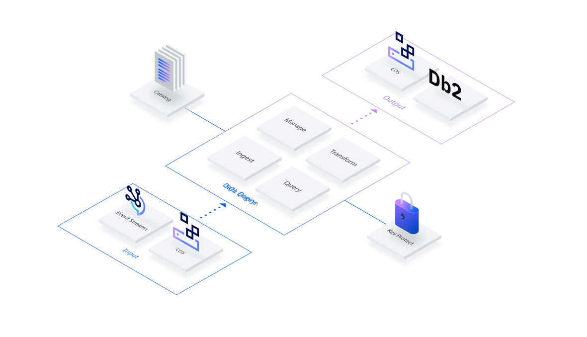

---

copyright:
  years: 2021, 2023

lastupdated: "2023-12-14"

keywords: streaming, stream landing

subcollection: sql-query

---

{{site.data.keyword.attribute-definition-list}}

# Stream landing
{: #event-streams-landing}

{{site.data.keyword.sqlquery_full}} is deprecated. As of 18 February 2024 you can't create new instances, and access to free instances will be removed. Existing Standard plan instances are supported until 18 January 2025. Any instances that still exist on that date will be deleted.
{: deprecated}

With stream landing, you can stream your data in real time from a topic to a bucket of your choice. {{site.data.keyword.sqlquery_short}} connects to {{site.data.keyword.messagehub_full}} and copies the data to Cloud {{site.data.keyword.cos_full}} in Parquet format. This capability enables efficient analytics on the new objects created.

{: caption="Figure 1. Stream landing" caption-side="bottom"}

You can enable a stream landing job on the {{site.data.keyword.messagehub}} UI by selecting the required resources, such as Cloud {{site.data.keyword.cos_short}} bucket, {{site.data.keyword.keymanagementservicelong}} instance, and the {{site.data.keyword.sqlquery_short}} instance by using a tailored wizard. If you want to stop the streaming job, switch to the {{site.data.keyword.messagehub}} UI. For more information about configuring stream landing in {{site.data.keyword.messagehub}}, see [Streaming to Cloud Object Storage by using Data Engine](/docs/EventStreams?topic=EventStreams-streaming_cos_sql).

## Using {{site.data.keyword.sqlquery_short}}
{: #using-event-streams}

You can also configure a stream landing job directly as an SQL query statement, without using the {{site.data.keyword.messagehub}} UI.

For event consumption, {{site.data.keyword.sqlquery_short}} reads data from an {{site.data.keyword.messagehub}} topic with a simple SQL statement, such as the following example:

```sql
SELECT * FROM crn:v1:bluemix:public:messagehub:us-south:a/2383fabbd90354d33c1abfdf3a9f35d5:4d03d962-bfa5-4dc6-8148-f2f411cb8987::/jsontopic STORED AS JSON 
EMIT cos://us-south/mybucket/events STORED AS PARQUET 
EXECUTE AS crn:v1:bluemix:public:kms:us-south:a/33e58e0da6e6926e09fd68480e66078e:5195f066-6340-4fa2-b189-6255db72c4f2:key:490c8133-5539-4601-9aa3-1d3a11cb9c44
```

The difference from a batch query is that the `FROM` clause points to a {{site.data.keyword.messagehub}} topic by using the CRN of an {{site.data.keyword.messagehub}} instance. The allowed format of the events is JSON. The `EMIT` specifies the Cloud {{site.data.keyword.cos_short}} bucket and the required format is Parquet. The last option to specify is a valid {{site.data.keyword.keymanagementserviceshort}} key that holds an API key with the permissions to read from {{site.data.keyword.messagehub}} and write to Cloud {{site.data.keyword.cos_short}}. The API key is needed, as theoretically, the job can run forever.

{{site.data.keyword.sqlquery_short}} uses private endpoints when available, which is only the case in Enterprise plans. Public endpoints are only used if private endpoints are not available or enabled.
{: note}

## Data on Cloud {{site.data.keyword.cos_short}}
{: #data-on-cos}

In addition to the objects that are written when you do a [batch query](https://cloud.ibm.com/docs/sql-query?topic=sql-query-overview#result=), the following two objects are also created:

- `_checkpoint`: Do not delete or modify the objects in this structure as it stores the last offsets of the topic.
- `_schema_as_json`: Do not delete or modify the objects in this structure as it stores the schema of the Kafka events.

The objects are written to Cloud {{site.data.keyword.cos_short}} in micro batches. The number of events that are included in one object depends on the specified event size and the provision rate of the topic. The same applies to the times when data is written to Cloud {{site.data.keyword.cos_short}}. If the provision rate is high, you see more objects within the same timeframe. If it is low, you see a new object at least every 5 minutes.

## Streaming job details
{: #streaming-job-details}

You can see your active streaming jobs in the **Streaming** tab of the job list in the UI. 
The details of a streaming job show that the states differ from batch query processing. *Stopping* is an extra state that indicates that {{site.data.keyword.sqlquery_short}} is stopping a running job. And instead of the *completed* state, a streaming job goes into the *stopped* state. The streaming states change from *queued* to *running* to *stopping* or *failed*.

The job details show the following metrics (instead of *rows_returned*, *rows_read* and *bytes_read*):

- `last_change_time`: Shows when the last object was written to Cloud {{site.data.keyword.cos_short}}.
- `rows_per_second`: Shows the number of records that were processed per second in the last micro batch.
- `last_activity_time`: Shows the time when the streaming job was last active, with or without processing rows.

## Monitoring streaming jobs
{: #monitor-streaming-jobs}

Monitoring your streaming jobs is important in order to understand if your streaming job keeps up with the load of incoming messages on your Kafka topic.

There are two monitoring systems to check to get fully informed about your streaming jobs. The first system to use is Sysdig monitoring. A default {{site.data.keyword.sqlquery_short}} dashboard exists, and you can define custom dashboards and alerts.

After you create your {{site.data.keyword.monitoringlong}} instance and select the instance for which you want to receive platform metrics, it takes a few minutes until you see **{{site.data.keyword.sqlquery_short}}** and **{{site.data.keyword.sqlquery_short}} Streaming** dashboards within the Dashboard Library. 

{: caption="Figure 2. Monitoring stream landing" caption-side="bottom"}

Graphs for all jobs:

- Queued streaming jobs: You can put an alert on this metric if jobs stay too long in queued state.
- Running streaming jobs: This metric helps you to see the number of all running jobs.
- Stopped streaming jobs: An alert on this metric detects any undesired stopping of streaming jobs.
- Failed streaming jobs: An alert on this metric helps to detect any misconfigurations or problems.

Graphs that can be filtered by instance job ID:

- Rows per second: This chart represents the number of rows (Kafka messages) processed per second while a batch is active. It gives you an indication whether the job processes data or is in an idle state.
- Number of offsets the job fell behind the Kafka topic: This graph helps to understand if there are more incoming messages than the job can handle. This chart is expected to be 0. If that is not the case or the backlog is growing, it means that the rate of incoming messages is too high for the streaming job and it needs additional resources. However, a high backlog may be ok, if your Kafka topic has a pattern of temporary load peaks and phases of fewer messages in between. Then you should see the backlog decreasing over time. In this scenario, check on the retention size and retention time that you configured for your Kafka topic, to make sure that the messages stay in the topic long enough for the streaming job to be able to process it.
- Time needed to catch up with the backlog on the Kafka topic: This chart gives you an indication of how long it takes for the streaming job to process the current backlog, given the current processing rate.

The second option to monitor streaming jobs is with {{site.data.keyword.cloudaccesstraillong}}. An instance of {{site.data.keyword.cloudaccesstrailshort}} must be created and selected to get all platform logs. {{site.data.keyword.sqlquery_short}} provides information about important events, such as stopped jobs (sql-query.sql-job.disable) or streaming jobs that can't process all messages before they get rolled out of the {{site.data.keyword.messagehub}} topic (sql-query.sql-job.notify). Especially the *sql-query.sql-job.notify* event helps to understand if the job loses data or if it is healthy and scaled enough to be able to process the incoming messages. In addition, there is the option to be alerted if the streaming job was not able to process a set of messages, because these messages were rolled out of the Kafka topic before the streaming job could process them. In such a case, check retention size and retention time of the Kafka topic and consider increasing them.

## Permissions
{: #permissions-event-streams}

The following permissions are needed for creating a stream landing job:

- Permission to create service-to-service authentication.
- Permission to write to {{site.data.keyword.secrets-manager_full}} or {{site.data.keyword.keymanagementservicelong}} (to store the API key).
- Permission to create service IDs and API keys. The service ID needs to have following permissions:
    - Writer role for the Cloud {{site.data.keyword.cos_short}} bucket.
    - Reader access role for the cluster, topic, and group resources within the {{site.data.keyword.messagehub}} service instance.

## Limitations
{: #limitations-streams-landing}

- With a stream landing job, you can process up to 1 MB event data per second. The final reached data throughput depends on parameters, such as topic partitions and size and format of the events.
- For one {{site.data.keyword.sqlquery_short}} instance, a maximum of five concurrent stream landing jobs are possible. The limit can be raised upon request by opening a support ticket.
- Ensure that the data retention time on {{site.data.keyword.messagehub}} is set to at least one day, to avoid loss of data. If data gets lost, the streaming job does not stop or fail.
