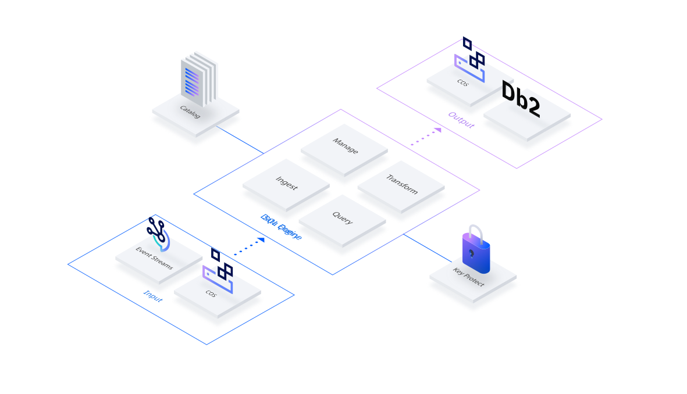

---

copyright:
  years: 2018, 2023
lastupdated: "2023-06-13"

keywords: SQL query, analyze, data, CVS, JSON, ORC, Parquet, Avro, object storage, SELECT, cloud instance, URI, endpoint, api, user roles

subcollection: sql-query

---

{{site.data.keyword.attribute-definition-list}}

# Overview
{: #overview}

{{site.data.keyword.sqlquery_full}} is a fully managed service that runs SQL queries (that is, SELECT statements) to read, analyze, transform, store, and stream data in {{site.data.keyword.cos_full}} and Kafka. You can also manage table metadata in a catalog that is compatible with Hive metastore.
{{site.data.keyword.sqlquery_short}} is {{site.data.keyword.Bluemix_short}}'s central service for data lakes. Combining {{site.data.keyword.sqlquery_short}} with data in {{site.data.keyword.cos_short}} enables you to create an active workspace for a range of big data analytics use cases.
{: shortdesc}

{: caption="Figure 1. {{site.data.keyword.sqlquery_short}} overview" caption-side="bottom"}

Input data is read from CSV, JSON, ORC, Parquet, or AVRO objects located in one or more Cloud {{site.data.keyword.cos_short}} instances.
Each query result is written to a CSV, JSON, ORC, Parquet, or AVRO object in a Cloud {{site.data.keyword.cos_short}} or Db2 instance of your choice.
Use the {{site.data.keyword.sqlquery_short}} user interface (UI) to [develop your queries](/docs/sql-query?topic=sql-query-running) and the [{{site.data.keyword.sqlquery_short}}REST API](#restapi) to automate them.

{: video output="iframe" data-script="none" id="watsonmediaplayer" width="560" height="315" scrolling="no" allowfullscreen webkitallowfullscreen mozAllowFullScreen frameborder="0" style="border: 0 none transparent;"}

## Input and output of queries
{: #input_output}

Before you can use the {{site.data.keyword.sqlquery_short}} service to run SQL queries, the input data must be uploaded to one or more Cloud {{site.data.keyword.cos_short}} instances. You must also have at least 'Writer' access to at least one Cloud {{site.data.keyword.cos_short}} bucket, so that result objects (that is, the objects that contain output data) can be written there. For more information about Cloud {{site.data.keyword.cos_short}}, including how to provision an instance, create buckets, and upload data, see the [Cloud Object Storage Getting Started Guide](/docs/cloud-object-storage/getting-started.html#getting-started-console) and [Reading and writing to Cloud {{site.data.keyword.cos_short}}](/docs/sql-query/blob/draft/reading_cos.md). You can also [write to databases](/docs/sql-query/blob/draft/writing_databases.md) and take advantage of [index management](/docs/sql-query?topic=sql-query-index_management).
.
## Programmatic access
{: #access}

### REST API
{: #restapi}

You can use the [{{site.data.keyword.sqlquery_short}} service REST API](https://cloud.ibm.com/apidocs/sql-query/sql-query-v3) to run queries and retrieve information about their status. This is especially helpful when you write code that automatically queries data.

**Note:** The Cloud Resource Name (CRN) is a mandatory part of a {{site.data.keyword.sqlquery_short}} REST endpoint call. The CRN Copy button copies your CRN to clipboard and you can paste it into your API call.

### Python applications and Notebooks
{: #python}

For a Python application, you can also use the [ibmcloudsql package](https://pypi.org/project/ibmcloudsql/).
Use IBM Watson Studio to run queries with {{site.data.keyword.sqlquery_short}} and visualize the query results with one of the various widget libraries available in [Watson Studio](https://cloud.ibm.com/catalog/services/data-science-experience).

### Cloud functions
{: #cloud}

{{site.data.keyword.sqlquery_short}} is a serverless mechanism to submit SQL queries, making it a natural match for the serverless [IBM Cloud Functions](https://www.ibm.com/cloud/functions). You can use the generic [SQL Cloud function](https://hub.docker.com/r/ibmfunctions/sqlquery) to run {{site.data.keyword.sqlquery_short}} as an IBM Cloud function.

### Geospatial functions
{: #geospatial-functions}

The [Geospatial Toolkit](https://www.ibm.com/support/knowledgecenter/en/SSCJDQ/com.ibm.swg.im.dashdb.analytics.doc/doc/geo_intro.html) provides a set of [geospatial functions](https://www.ibm.com/support/knowledgecenter/en/SSCJDQ/com.ibm.swg.im.dashdb.analytics.doc/doc/geo_functions.html) that you can use to efficiently process and index spatial data. These functions are integrated into the {{site.data.keyword.sqlquery_short}} service and ready for immediate use. The {{site.data.keyword.sqlquery_short}} service also provides several sample queries that illustrate how to use these functions.

## Required user roles
{: #user-roles}

The following table shows which user roles are required to start a particular service action or API endpoint. Use this information to decide which access rights to grant your users when you create new user IDs.

Description | Service action | API endpoint | Required user roles
--- | --- | --- | ---
Submit an SQL query. | sql-query.api.submit | `POST/v2/sql_jobs/` | Manager or Writer
Get information for all submitted jobs. | sql-query.api.getalljobs | `GET/v2/sql_jobs/` | Manager, Writer, or Reader
Get information for a specific submitted job. | sql-query.api.getjobinfo | `GET/v2/sql_jobs/{job_id}` | Manager, Writer, or Reader
Submit a catalog or index management statement. | sql-query.api.managecatalog | `POST/v2/sql_jobs/` | Manager
{: caption="Table 5. User roles" caption-side="bottom"}

## Behavior of scanned data
{: #data-scanned}

{{site.data.keyword.sqlquery_short}} reads as little data as possible based on your query. The amount of data that is scanned depends on the amount of data that {{site.data.keyword.sqlquery_short}} must read to run your query, and not on the actual size of your data. Several factors play a role when it comes to how much data needs to be accessed to run a query. First, data layout is important. Columnar formats, such as Parquet, lead to less data to be scanned, as {{site.data.keyword.sqlquery_short}} can selectively read ranges and single columns. Furthermore, the actual object layout determines how many objects need to be scanned. Read [How to lay out big data in IBM Cloud Object Storage for Spark SQL](https://www.ibm.com/cloud/blog/big-data-layout) for more details on how to lay out big data on Cloud {{site.data.keyword.cos_short}} to improve cost and performance of SQL queries. Each successful query is charged with at least 10 MB.

### Example
{: #data-scanned-example}

Assume you have 1 PB of data that is stored on Cloud {{site.data.keyword.cos_short}} that is laid out as described in the [blog post](https://www.ibm.com/cloud/blog/big-data-layout) and is optimized for the queries you want to run. If you run a single query, the most expensive query possible is `SELECT * FROM`, as reading 1 PB of data is required. Any other query is much cheaper and faster. For example, a 1 PB data set consists of audit events for users of a system (user A performed action B in system X at time T) and the data is laid out in a way that it is partitioned by time (one file per day and system). So to answer a query like `SELECT DISTINCT user FROM WHERE System='X' AND Day >= (TODAY - 30)`, {{site.data.keyword.sqlquery_short}} must access all objects for system X that contain data for the last 30 days. The sum of the size of these objects is the maximum estimate of data that is scanned that you would be charged for. But as {{site.data.keyword.sqlquery_short}} accesses only one field, and data is stored as Parquet, it is much less. Calculating the precise price of the query is not possible in advance because much of it depends on the data itself. Parquet, for example, stores compressed columns, so if the column can be compressed effectively, even less data needs to be read. You also find some further details in the blog post [{{site.data.keyword.sqlquery_short}} releases serverless transformation and partitioning of data in open formats](https://www.ibm.com/cloud/blog/announcements/sql-query-releases-serverless-transformation-and-partitioning-of-data-in-open-formats) about {{site.data.keyword.sqlquery_short}} ETL capabilities and how they affect scanned data.

## Timestamps
{: #timestamps}

Values of the **timestamp** data type are created with Coordinated Universal Time (UTC) zone by default. So, for instance, the expressions `timestamp('2009-07-30 04:17:52')`, `to_timestamp('2016-12-31', 'yyyy-MM-dd')`, or `current_timestamp` all results in a Coordinated Universal Time timestamp value and the input string expressions are assumed to be in Coordinated Universal Time.

If you want to create a Coordinated Universal Time timestamp from a string expression that represents a different time zone, use [`to_utc_timestamp`](/docs/sql-query?topic=sql-query-sqlfunctions#to_utc_timestamp), as in `to_utc_timestamp('2016-08-31', 'Asia/Seoul')`.

You can also create timestamp values in a different time zone from a Coordinated Universal Time timestamp value, or a Coordinated Universal Time string expression that is using [`from_utc_timestamp`](/docs/sql-query?topic=sql-query-sqlfunctions#from_utc_timestamp), as in `from_utc_timestamp(current_timestamp, 'Asia/Seoul'),` or `from_utc_timestamp('2016-08-31', 'Asia/Seoul')`.

## Limitations
{: #limitations}

- If a JSON, ORC, or Parquet object contains a nested or arrayed structure, a query with CSV output that uses a wildcard (for example, `SELECT * from cos://...`) returns an error such as "Invalid CSV data type used: `struct<nested JSON object>`." Use one of the following workarounds:
    - For a nested structure, use the [`FLATTEN`](/docs/sql-query?topic=sql-query-sql-reference#tableTransformer) table transformation function. Alternatively, you can specify the fully nested column names instead of the wildcard, for example, `SELECT address.city, address.street, ... from cos://...`.
    - For an array, use the Spark SQL explode() function, for example, `select explode(contact_names) from cos://...`.

- If you receive a corrupted result, verify that the source URI is correct and that the correct input format is specified, by using 'STORED AS' in the SQL statement.

- If you receive an error message that states that some columns are not found in the input columns, but the columns do exist in the input, check if the input format that is specified as 'STORED AS' in the SQL statement is the actual format of your input.

- To process CSV input with {{site.data.keyword.sqlquery_short}}, each row must be contained within one line. Multi-line values are not supported.

    If you use {{site.data.keyword.sqlquery_short}} to generate CSV results from other data formats like Parquet that support newlines within values and these CSV results are queried again, newlines must explicitly be removed before you write the results. To do so, use the SQL function `regexp_replace`. For example, a Parquet object `data` has an attribute `multi_line` containing values that span multiple lines. To select a subset of rows based on a `condition` and store it on Cloud {{site.data.keyword.cos_short}} for further processing, a skeleton SQL statement looks like the following example:

    `SELECT regexp_replace(multi_line, '[\\r\\n]', ' ') as multi_line FROM data STORED AS parquet WHERE condition`
